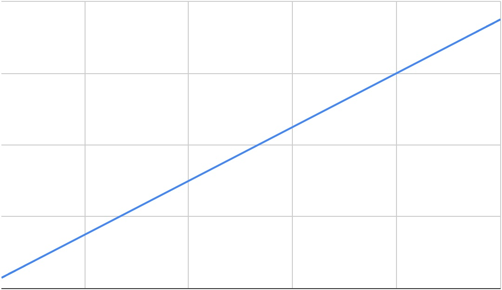
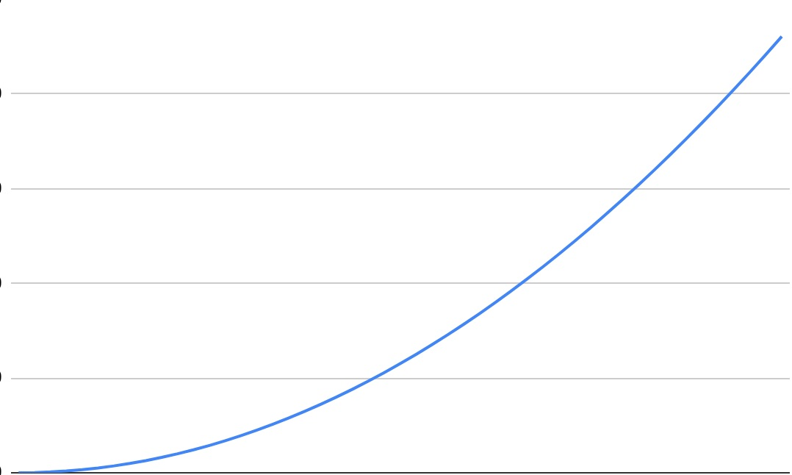
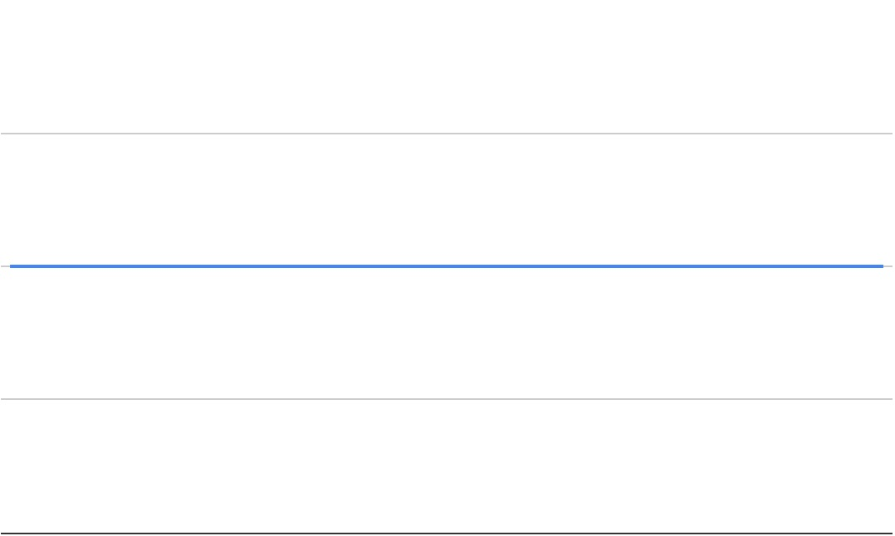

# M2Wk3D2 Big-O

## [Learning Boost](https://open.appacademy.io/learn/js-py---pt-jul-2023-online/week-9---big-o/learning-boost---tuesday) 5 Min

<br/>

## Efficient Coding
So far in this program we have learned how to solve problems through coding. But we have yet to talk about solving our code in a more efficient manner.

In simple terms more efficient code has a lower number of times it does something. This will be referred to as n's or n times.

We can test how efficient our code is a couple of ways.

- Timing benchmarks

```
function addTwoNums(num1, num2) {
  let total = 0;
  for (let i = 0; i < num1; i++) {
    total += 1;
  }
  for (let i = 0; i < num2; i++) {
    total += 1;
  }
  return total;
}
startTime = Date.now();
addTwoNums(1234, 5678);
endTime = Date.now();
// startTime = Date.now();
// addTwoNums(1234567890, 1234567890);
// endTime = Date.now();
// startTime = performance.now();
// addTwoNums(1234, 5678);
// endTime = performance.now();
console.log(`Runtime: ${endTime - startTime}ms`);
```

- Make our lives easy and use Big-O notation

## Intro to Big-O Time Complexity
The "O" in big-O stands for "order" which means that it is not concerned with exact values: instead, it is used to describe the general shape of the growth curve.

Typical growth curves are

### Linear - O(n) 

When an algorithm has a time complexity of O(n)
it means that the time it takes to execute the algorithm grows linearly with the size of the input. In other words, if the input size doubles, the time taken to execute the algorithm will also roughly double.

```
function addNums(n) {
  total = 0;
  for (let i = 1 ; i <= n ; i++) {
    total += i;
  }
  return total;
}
```

<br/>

### Quadratic - O(n^2) 

When an algorithm has a time complexity of O(n^2)
it means that the number of operations required to execute the algorithm is roughly proportional to the square of the size of the input. This implies that as the input size increases, the time taken by the algorithm increases quadratically.

```
function addNums(n) {
  total = 0;
  for (let i = 1 ; i <= n ; i++) {
    total += i;
  }
  return total;
}
function addManyNums(n) {
  let total = 0;
  for (let i = 0 ; i < n ; i++) {
    total += addNums(i);
  }
  return total;
}
```

<br/>

### Constant - O(1) 

When an algorithm has a time complexity of O(1)
it means that the number of operations required to execute the algorithm remains constant, regardless of the size of the input. This implies that the algorithm's performance does not degrade as the input size increases.

```
function addFirstAndLast(nums) {
  const firstNum = nums[0];
  const lastNum = nums[nums.length - 1];
  return firstNum + lastNum;
}
```
<br/>

### Nested Loops vs. Adjacent
Nested loops are an easy way to identify that you may be doing something n to the power of nested loop times

```
function printPairSums(n) {
  for (let i = 0 ; i < n ; i++) {
    for (let j = 0 ; j < n ; j++) {
      console.log(`${i} + ${j} = ${i + j}`);
    }
  }
}
```
We can identify that this function has a Big O of O(n^2)
This is because

The outer loop runs n times
For each of those n iterations, the inner loop runs
n times as well
So, the total number of iterations is n * n otherwise known as O(n^2)

<br/>

Now if we do this with three nested loops

```
function printTripleSums(n) {
  for (let i = 0 ; i < n ; i++) {
    for (let j = 0 ; j < n ; j++) {
      for (let k = 0 ; k < n ; k++) {
        console.log(`${i} + ${j} + ${k} = ${i + j + k}`);
      }
    }
  }
}
```
We can identify that this function has a Big O of O(n^3)
This is because

The outer loop runs n times
For each of those n iterations, the first inner loop runs
n times as well
Now for each of those inner loop iterations the inner most loop will run n times as well
So, the total number of iterations is n * n * n otherwise known as O(n^3)

#### Adjacent Loops
You may think that it shouldnt be much different with adjacent loops but it is.

```
function printNumbersTwice(n) {
  for (let i = 0 ; i < n ; i++) {
    console.log(i);
  }
  for (let j = 0 ; j < n ; j++) {
    console.log(j);
  }
}
```
If we have two loops that are next to eachother and not nested than we only perform two seperate loops a constant n amount of times

This would simplify down to n + n which would technically be O(2n)

In big o notation we dont care about the small number of constant operations we are performing, so we would continue to simplify this down to O(N)

## Space Complexity
Space complexity is closely related to time complexity. Both describe the performance of code in relation to the input size and both are expressed using big-O notation. The difference is that space complexity describes how much memory the function requires.

#### Linear space complexity O(n)

```
function getNumList(n) {
    let nums = [];
    for (let i = 0 ; i < n ; i++) {
        nums.push(i);
    }
    return nums;
}
```
Let nums = [] creates an empty array that brings us to O(1)
Our loop pushes into this array on every iteration adding space + 1 n amount of times
Which means we are creating space on every
So our Space Complexity would be O(n)


```
function getNumPairsList(n) {
    let pairs = [];
    for (let i = 0 ; i < n ; i++) {
        for (let j = 0 ; j < n ; j++) {
            pairs.push([i, j]);
        }
    }
    return pairs;
}
```


<br/>

## Reading && Practices 35 mins
- [Intro to Computer Science](https://open.appacademy.io/learn/js-py---pt-jul-2023-online/week-9---big-o/intro-to-computer-science) 5 - mins

- [Timing Benchmarks](https://open.appacademy.io/learn/js-py---pt-jul-2023-online/week-9---big-o/timing-benchmarks) - 5 mins

- [Timing Practice part 1](https://open.appacademy.io/learn/js-py---pt-jul-2023-online/week-9---big-o/timing-benchmarks-practice-part-1) - 20 mins
    - 15 min Q&A

## Reading && Practices 20 mins
- [Timing Practice part 2](https://open.appacademy.io/learn/js-py---pt-jul-2023-online/week-9---big-o/timing-benchmarks-practice-part-2) - 20 mins
    - 15 min Q&A

## Reading && Practices 20 mins
- [Timing Practice part 3](https://open.appacademy.io/learn/js-py---pt-jul-2023-online/week-9---big-o/timing-benchmarks-practice-part-3) - 20 mins
    - 15 min Q&A


<br/>

# [Formative Quiz](https://open.appacademy.io/learn/js-py---pt-jul-2023-online/week-9---big-o/formative-quiz---tuesday--repeat-) - 10 minutes


# EOD
