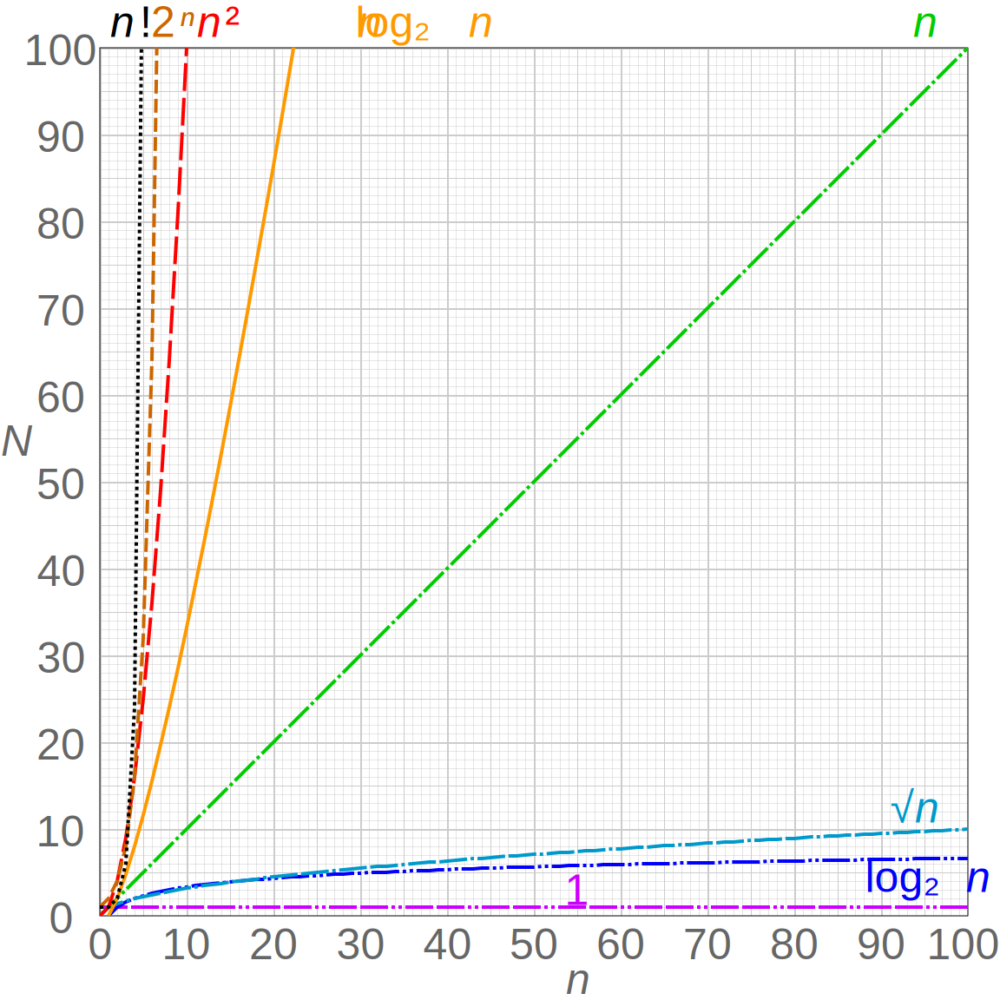

# M2Wk5D2 Logarithims - Graphs && Binary Trees

## [Learning Boost](https://open.appacademy.io/learn/js-py---pt-jul-2023-online/week-11---binary-search-and-trees/learning-boost---tuesday) 5 Min

<br/>

## Logarithims
In simple terms, a logarithim is the power that a number needs to be raised to in order to get another number

With logarithims we always have bases and in computer science are base will be 2 for binary.

So if we wanted to find the logarithim of 8 it would look like this

```
logBase2^? = 8
// we need to find out what power we need to take 2 to in order to find our logarithim
2*2 = 4 // 2^2
4*2 = 8 // 2^3

logBase2^3 = 8
```
In this case above, our logarithim would be 3 since we can take 2 to the power of 3 to get the number 8

### Why Logarithims
We have learned about constant, linear, and quadratic complexity. But logarithmic is also a complexity that we can evaluate.



### Using Math.log [MDN Docs](https://developer.mozilla.org/en-US/docs/Web/JavaScript/Reference/Global_Objects/Math/log)
We can use Math.log to help us see the difference between linear and logarithmic complexity

```
function getBaseLog2(input) {
  let logBase2ofInput = Math.log(input) / Math.log(2);
  return logBase2ofInput;
}

console.log(getBaseLog2(8), Math.log2(8));

console.log(getBaseLog2(625), Math.log2(625));

const n = 10000000;
const logN = getBaseLog2(n);

console.log("Amount of times are itertion will run", logN);

console.time("N");
for (let i = 0; i < n; i++) {}
console.timeEnd("N");

console.time("LogN");
for (let i = 0; i < logN; i++) {}
console.timeEnd("LogN");
```
This week and next we will be learning how we can create logarithmic time complexity through binary searches.

</br>


## Graphs
A graph is a collection of nodes and any edges between those nodes. You've likely seen depictions of graphs before, and they usually exist as circles (nodes) and arrows (edges) between those circles.


## Trees
A tree is a graph that does not contain any cycles. A cycle is defined as a path through edges that begins and ends at the same node.

Trees are a common data structure upon which many other data structures are based. You can think of them as being like a singly-linked list, except that instead of each node having a single next node, it may have more than one child node.


## Binary Trees
A binary tree is a tree where nodes have at most 2 children. This means graphs 1, 2, and 3 are all Binary Trees. There exist ternary trees (at most 3 children) and n-ary trees (at most n children)

```
class TreeNode {
  constructor(val) {
    this.val = val;
    this.left = null;
    this.right = null;
  }
}

let a = new TreeNode('a');
let b = new TreeNode('b');
let c = new TreeNode('c');
let d = new TreeNode('d');
let e = new TreeNode('e');
let f = new TreeNode('f');

a.left = b;
a.right = c;
b.left = d;
b.right = e;
c.right = f;
```


### Traversing a Tree Vs. Linked List

```
//Linked List traversal
function linkedListSearch(linkedList, target) {

    // Base case: empty list
    if (linkedList.head === null) return false;

    // Check if the current node's value matches the target
    if (linkedList.head.value === target) return true;

    // If not, recursively search the rest of the list
    return linkedListSearch(linkedList.head.next, target);
}

```
vs.

```
// Binary Tree Traversal
function binaryTreeSearch(root, target) {

    // Base case: If the tree is null, return false
    if (root === null) return false;

    // If the current node's value equals the target, return true
    if (root.value === target) return true;

    // Otherwise, search the left subtree for the target
    if (binaryTreeSearch(root.left, target)) return true;

    // If the value isn't in the left subtree, try the right subtree
    return binaryTreeSearch(root.right, target);
}
```

### Binary Search Trees
Binary search trees are a node-and-pointer-based data structure, similar to a doubly linked list, that allows for the same O(log n) search as a sorted array, but with O(log n) insertion and deletion as well.

The caviat is that in order to achieve O(logn) complexity, this search tree needs to be ordered

### How are they Ordered?
The key difference that makes it a binary search tree is that every node contained in the left branch of any node will be less than the value of the node itself, and every node in the right branch will be greater than the node value.

There are three possible implementations for handling values that are equal to a value in an existing node:

Discard the duplicate, similar to a set
Place equal values to the left
Place equal values to the right

<br/>

### Solo Practice 20 minutes
- [Binary Search](https://open.appacademy.io/learn/js-py---pt-jul-2023-online/week-11---binary-search-and-trees/binary-search)
    - Q&A
<br/>

### Solo Practice 20 minutes
- [Binary Search Trees pt1](https://open.appacademy.io/learn/js-py---pt-jul-2023-online/week-11---binary-search-and-trees/binary-search-tree-practice-part-1)
    - Q&A
<br/>

### Solo Practice 20 minutes
- [Binary Search Trees pt2](https://open.appacademy.io/learn/js-py---pt-jul-2023-online/week-11---binary-search-and-trees/binary-search-tree-practice-part-2)
    - Q&A
<br/>

## [Formative Quiz](https://open.appacademy.io/learn/js-py---pt-jul-2023-online/week-11---binary-search-and-trees/formative-quiz---tuesday--repeat-)

# EOD
