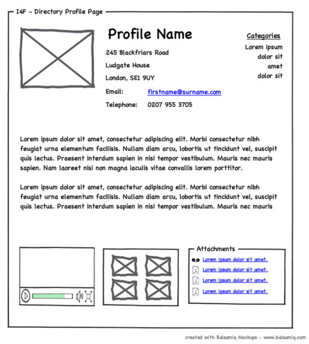

## Cypress Testing
Cypress can be used to test anything that runs in a web browser, including basic HTML and CSS code, React applications, and applications built with other tech stacks.

You'll notice several files in any practices/assessments that cuse cypress test have the following items in the directory:
- package.json : include all packages and dependencies needed (including cypress)
- cypress.json : includes configuration for the Cypress Tests
- cypress directory : holds the test files, typically within the integration directory.

we'll run `npm test` to run our cypress tests, these tests are pretty slow so we don't want to run them for every line of code.

```javascript
describe("Elements on index.html", function () {
    before(function () {
      cy.visit("index.html");
    });

    it("has one reset button element and one submit button element", function () {
      cy.get("button[type='reset']")
        .should('have.length', 1)
        .should('contain', 'Reset Form');
      cy.get("button[type='submit']")
        .should('have.length', 1)
        .should('contain', 'Submit Recipe');
    });
})
```
## HTML, and Accessibility
### HTML
In the reading `Using MDN Documentation` from the HW for Tuesday Week 13, there are links to the landing pages for HTML and CSS on MDN.

HTML is made of three components that form the basic building blocks:
- Tags : The text inside <> that tells the text how to format itself. There's usually an opening and closing tag, but the closing tag has a /. `There are a ton to checkout on MDN`
```html
```
- Elements : There are two definitions of an element: 1) If a tag has an opening and closing tag then the element is the opening tag, the closing tag, and the content between them, 2) If the tag does not have a closing tag, then the element is just the tag itself.
```html
```
- Attributes : They're used to define additional information about an element and are located inside of the opening tag.

Comments in HTML are done like so...
```html
<!-- your comment here -->
```

The Browser ignores whitespace when parsing HTML...
```html
<tag attr1="value1" attr2="value2" attr3="really-long-attribute-value-that-is-really-long">content</tag>

<tag attr1="value1"
     attr2="value2"
     attr3="really-long-attribute-value-that-is-really-long">content</tag>

<tag
  attr1="value1"
  attr2="value2"
  attr3="really-long-attribute-value-that-is-really-long"
>content</tag>
```
### Accessibility
Web accessibility focuses on implementing design decisions that make a website accessible for a variety of users.

Generally thought to support uers with disabilities including various physical and cognitive disabilities but when we design with accessibility in mind, we make the web a better user-experience for all users.

There is a legal set of guidelines for designing web-content, The Web Content Accessibility Guidelines (WCAG).
The WCAG is split into 4 principles:
- Percievable : Info and UI components must be presentable to users in ways they can percieve.
- Operable : UI components and navigation must be operable.
  - You should be able to perform all operations with a keyboard as opposed to relying on a mouse)
  - A links must be clearly labeled for thier purpose.
  - Interaction Targets must be large enough to be user friendly.
- Understandable : Info and the operation of the UI must be understandable.
  - The web page specifies its language.
  - When there are errors there are clear error messages.
  - Predictable navigation patternes exist as well as clear instruction or directions for users.
Robust : Content must be robust enough that it can be interpreted by a wide variety of user agents, including assistive technologies.
  - All elements have unique `id` attributes.
  - All HTML syntax is correct, including appropriate nesting and opening/closing tags.


We don't expect you to memorize every guideline of the WCAG so we recommend you use this website to check how your websites stack up: https://www.accessibilitychecker.org/

## Wireframes
Wireframes are to a website what blueprints are to a house. They're the guide for building them.
